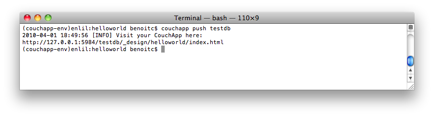
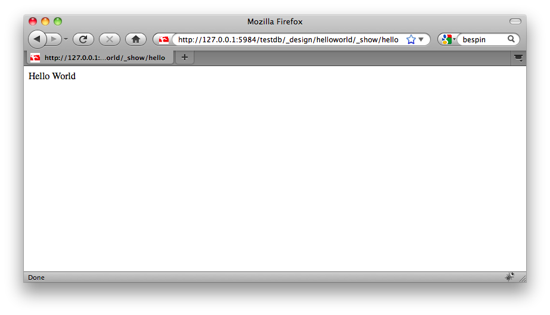
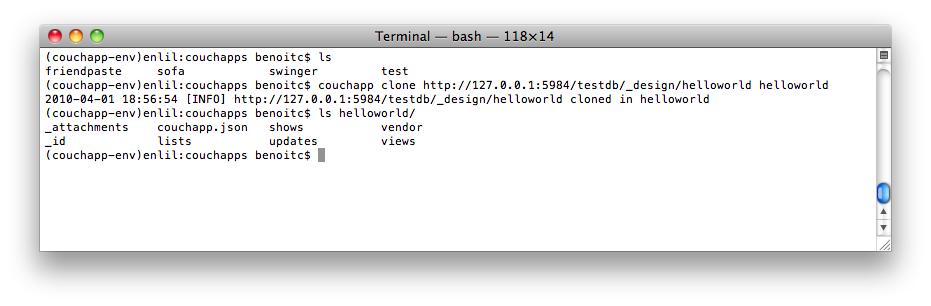

# Getting Started

In this tutorial you will learn how to create your first CouchApp (embedded
applications in [CouchDB](http://couchdb.apache.org/))
using the `couchapp` script.

## 1\. Generate your application

couchapp provides you the `generate` command to initialize your first
CouchApp. It will create an application skeleton by generating needed folders
and files to start. Run:

    
    
    $ couchapp generate helloworld
    

## 2\. Create a show function

To display our hello we will create a show function.

    
    
    $ cd helloworld/
    $ couchapp generate show hello
    

Here the generate command create a file named `hello.js` in the folder
`shows`. The content of this file is :

    
    
    function(doc, req) {  
    
    }
    

which is default template for `show` functions.

For now we only want to display the string "Hello World". Edit your show
function like this:

    
    
    function(doc, req) {
        return "Hello World";
    }
    

## 3\. Push your CouchApp

Now that we have created our basic application, it's time to **push** it to
our CouchDB server. Our CouchDB server is at the url http://127.0.0.1:5984 and
we want to push our app in the database testdb:

    
    
    $ couchapp push testdb
    

Go on

    
    
    http://127.0.0.1:5984/testdb/_design/helloworld/_show/hello  
    

you will see:

## 4\. Clone your CouchApp

So your friend just pushed the helloworld app from his computer. But you want
to edit the CouchApp on your own computer. That's easy, just **clone** his
application:

    
    
    $ couchapp clone http://127.0.0.1:5984/testdb/_design/helloworld helloworld
    

This command fetches the CouchApp `helloworld` from the remote database of
your friend.

Now you can edit the couchapp on your computer.

